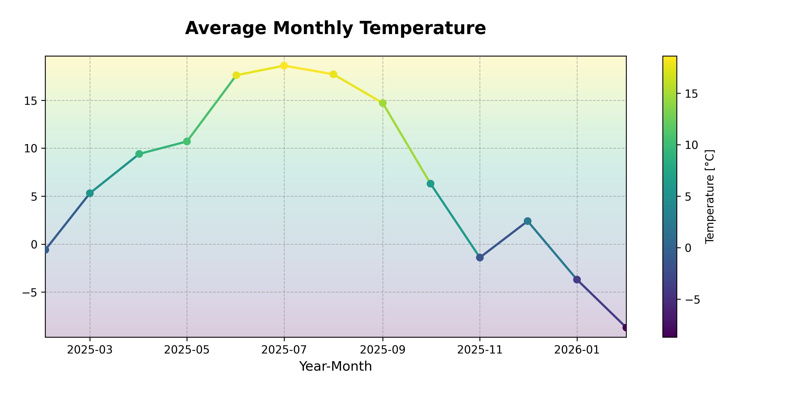

# Auto Sky Logger

## About the project
<p align="center">
  
</p>

[](https://github.com/Yorick0499/Auto-Sky-Logger/actions "Tests")
[](LICENSE "LICENSE")


Auto Sky Logger (ASL) is an automated program that collect weather data from the [IMGW API](https://danepubliczne.imgw.pl/api/data/synop/) for a chosen station and stores it in a MongoDB. It runs periodically and collects historical weather data over time.

## Example: Average Monthly Temperature for Kłodzko
The example below is a visualization of collected data over time, showing the average monthly temperature for Kłodzko:


## How ASL works
- GitHub Actions runs a workflow that scrapes weather data periodically.
- Collected data is stored in MongoDB.
- Historical data can be used for analysis and visualization.


## Usage

1. Clone the repository:
  ```bash
  git clone https://github.com/Yorick0499/Auto-Sky-Logger.git
  cd WeatherDB
  ```
2. Install dependencies:
   ```bash
   pip install -r requirements.txt
   ```
3. Configure your MongoDB connection (replace MONGO_URI with your own).
4. Run ASL manually, or schedule it using cron.

## Data Structure
The MongoDB stores weather data with fields such as:
  - id_stacji - station id
  - stacja - station name
  - data_pomiaru - measurement date
  - godzina_pomiaru - measurement hour
  - temperatura - temperature [°C]
  - predkosc_wiatru - wind speed
  - kierunek_wiatru - wind direction
  - wilgotnosc_wzgledna - relative humidity
  - suma_opadu - total precipitation
  - cisnienie - pressure


## Notes
- This project is primarily as a personal automation, but anyone is welcome to fork and adapt it.
- Charts are not generated automatically (but this feature is planned). Currently, they can be created locally from MongoDB data in the repository.
